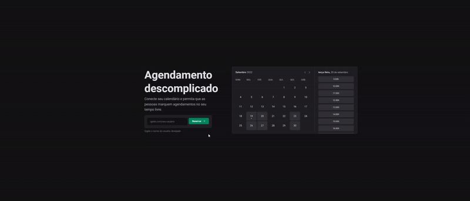

<h1 align="center">
  Ignite Call
</h1>

<p align="center">
  Ignite Call é uma aplicação de agendamento de chamadas e reuniões,proporcionando uma experiência eficiente e organizada para usuários integrada com Google calendar.
</p>

<p align="center">
  <a href="#como-executar">ℹ️ Como Executar?</a>&nbsp;&nbsp;&nbsp;|&nbsp;&nbsp;&nbsp;
  <a href="#web">💻 Web</a>&nbsp;&nbsp;&nbsp;|&nbsp;&nbsp;&nbsp;
  <a href="#tecnologias">🚀 Tecnologias</a>&nbsp;&nbsp;&nbsp;
</p>

---

# Como Executar?

> Clone o Repositório:

Node version 20.10.0

Clone

```bash
git clone https://github.com/JonatanPaes/ignite-call.git
```

Para executar o projeto

```bash
cd ignite-call
```

Instale as dependências do projeto

```bash
npm install
```


# Web
Para executar o projeto

```sh
# Copiar o arquivo com os dados de conexão e demais variáveis ambiente
cp .env.example .env

# Rodar as migrations do prisma
npx prisma migrate dev

# Executar a aplicação
npm run dev
```

<p align="center">
  
</p>

# Tecnologias
- [NextJS](https://nextjs.org/)
- [NextAuth.js](https://next-auth.js.org/)
- [TypeScript](https://github.com/microsoft/TypeScript)
- [@jonatanpaes-ui/react](https://www.npmjs.com/package/@jonatanpaes-ui/react)
- [Polished](https://polished.js.org/)
- [React Hook Form](https://react-hook-form.com/)
- [Zod](https://zod.dev/)
- [Prisma](https://www.prisma.io/)
- [Axios](https://axios-http.com/)
- [Nookies](https://github.com/maticzav/nookies)
- [Day.js](https://day.js.org)
- [TanStack Query](https://tanstack.com/query/latest)
- [Google APIs](https://github.com/googleapis/google-api-nodejs-client#readme)
- [Next Seo](https://github.com/garmeeh/next-seo#readme)